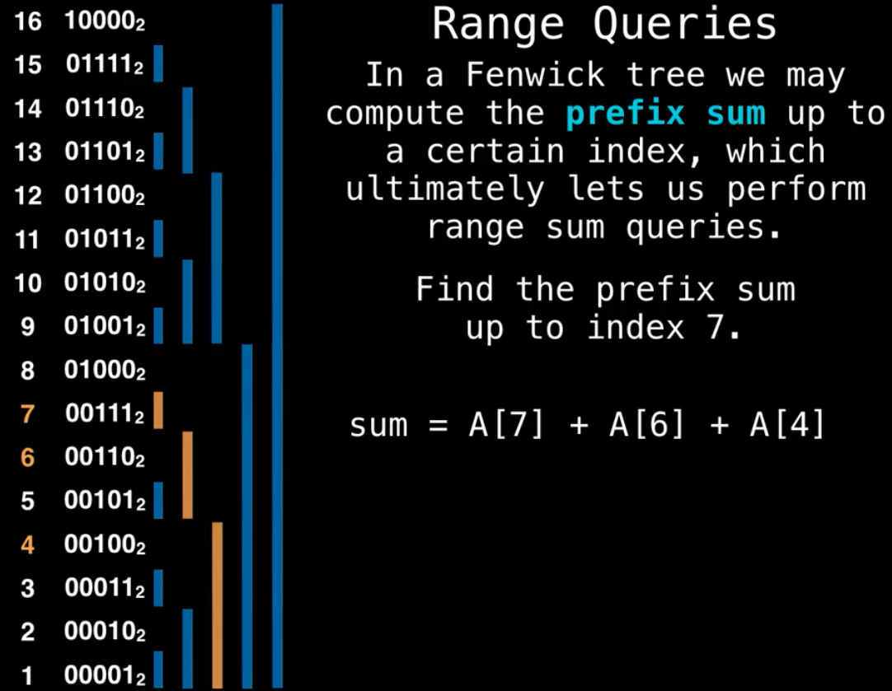

# Data Structures — Implementation Notes

Positives, negatives, and algorithm thought-process for each structure built from scratch in the `Data_structures` package. No code — contracts and reasoning only.

## Contents
1. [Static_array](#static_array)
2. [Dynamic_array](#dynamic_array)
3. [Singly_linked_list](#singly_linked_list)
4. [Doubly_linked_list](#doubly_linked_list)
5. [Stack](#stack)
6. [Queue](#queue)
7. [Heap](#heap)
8. [Priority_queue](#priority_queue)
9. [Union_find](#union_find)
10. [Union_find_compressed](#union_find_compressed)
11. [Binary_search_tree](#binary_search_treee-extends-comparable)
12. [Hash_table](#hash_tablek-v)
13. [Fenwick_tree](#fenwick_tree-binary-indexed-tree)
14. [Suffix_array + LCP array](#suffix_array--lcp-array)
15. [Balanced binary search trees](#balanced-binary-search-trees)
16. [AVL tree](#avl-tree)
17. [Indexed priority queue](#indexed_priority_queue)
18. [Sparse table](#sparse_table)

---

## Static_array<E>

Fixed-capacity contiguous backing. Index maps directly to a memory offset.

### Positives
- Access by index O(1) — direct offset, no walking.
- Add into an empty slot is O(1) (no resize ever happens).
- Lowest memory overhead of any structure — no pointers, no spare capacity.
- Cache-friendly: contiguous layout.

### Negatives
- Fixed size. Can't grow; full means full.
- Remove is O(n) — shift everything after the gap down.
- Insert in the middle is O(n) for the same reason.
- Search is O(n) (unsorted) — no index for a value, must scan.

### Algorithm / thought process
Backing is one `Object[]` of fixed length. Index `i` is a direct lookup, that's the whole point — O(1) access and O(1) set.

Removal is the cost center: deleting index `i` leaves a hole, so everything from `i+1` to the end shifts left one slot. Linear work. Same logic for mid-array insert (shift right to open a slot).

No resizing logic at all — capacity is set once at construction. If you need growth, that's a dynamic array.


---

## Dynamic_array<E>

Static array that resizes itself. Tracks `size` (used) separately from `capacity` (allocated).

### Positives
- Access by index O(1) — same direct-offset trick as static.
- Append amortized O(1) — most appends are free, the occasional resize averages out.
- Resizable — no fixed cap; grows on demand.

### Negatives
- Insert/remove in the middle is O(n) — still has to shift.
- Resize cost is O(n) when it triggers (allocate new array, copy everything over).
- Over-allocates: capacity is usually larger than size, so wasted memory.

### Algorithm / thought process
Two numbers matter: `size` and `capacity`. Append writes at index `size`, then `size++`. When `size == capacity`, double the capacity, allocate a new array, copy elements, swap it in.

Why doubling and not +1? Amortization. Doubling means resizes happen at 1, 2, 4, 8, ... — geometrically rare. Total copy work across n appends sums to ~2n, so per-append cost averages to O(1). That's the "amortized" claim, not worst-case.

Shrinking: halve capacity when size drops to ~1/4 (not 1/2). The gap between the grow threshold and shrink threshold stops thrashing — you don't want grow→shrink→grow on repeated add/remove at the boundary. (This is the "only ½ discard → log n" idea: leave hysteresis.)

Remove still shifts, so it's O(n) regardless of the resize machinery.


---

## Singly_linked_list<E>

Chain of nodes, each holding a value and a `next` pointer. Head pointer is the entry point.

### Positives
- Insert/remove at head O(1) — just repoint head.
- Append O(1) if you keep a tail pointer.
- Truly dynamic size, node by node — no resize, no copy.
- Less memory than doubly (one pointer per node).
- Simple.

### Negatives
- Access/search by index O(n) — must walk from head; no random access.
- Can't traverse backward — only one direction.
- Remove tail is O(n) even with a tail pointer — you need the *previous* node to fix its `next`, and there's no back-link to find it.

### Algorithm / thought process
Each node points only forward. You hold `head` (and usually `tail`).

Insert at head: new node's `next` = old head, then head = new node. Constant.

Remove head: head = head.next. Constant.

Tail is the asymmetry. Appending is cheap with a tail pointer, but *removing* the tail means the new tail is the second-to-last node — and to find it you walk the whole list, because no node knows its predecessor. That O(n) tail-removal is exactly what the doubly linked list fixes.

Traversal is one-directional: to "reverse" you'd have to rebuild pointers, you can't just walk back.


---

## Doubly_linked_list<E>

Linked list where each node has both `next` and `prev`. Maintains head and tail.

### Positives
- Traverse in both directions.
- Remove a known node in O(1) — you have its `prev`, so you can splice it out without walking.
- O(1) insert/remove at *both* head and tail (tail removal is cheap here, unlike singly).

### Negatives
- ~2x pointer memory (every node stores `prev` too).
- More bookkeeping — every insert/remove must fix up to four pointers (the node's prev/next and the neighbors' links), easy to get wrong.

### Algorithm / thought process
The `prev` pointer buys two things: backward traversal, and O(1) tail removal. Removing the tail just needs `tail = tail.prev; tail.next = null` — no walk, because the back-link is already there.

The cost is discipline. Any splice touches the node and both neighbors. Insert between A and B: new.prev=A, new.next=B, A.next=new, B.prev=new. Miss one and the list corrupts silently in one direction.

This is why `toStringReverse` (walk via `prev` from tail) is a useful test — it catches a broken back-link that a forward-only `toString` would never reveal.

Stack and Queue are both built on this: head/tail O(1) access in both directions covers LIFO and FIFO cleanly.


---

## Stack<E>

LIFO (last in, first out). Built on Doubly_linked_list: push/pop both hit the head.

### Positives
- push, pop, peek all O(1).
- Dead simple — one access point (the top).
- Natural fit for DFS, recursion unrolling, undo, expression/bracket matching.

### Negatives
- No random access — only the top is reachable.
- No search without destroying the stack (you'd have to pop everything).

### Algorithm / thought process
LIFO means the only interesting end is the top. Mapping onto the doubly linked list: push = add to head, pop = remove head, peek = read head value. All O(1) because head ops are O(1).

Could equally back it with a dynamic array (push = append, pop = remove last) — also amortized O(1). The linked-list version avoids resize cost; the array version is more cache-friendly. Either satisfies the contract.

Why DFS uses it: you push neighbors and pop the most recent, so you dive deep before going wide — that's depth-first by construction.


---

## Queue<E>

FIFO (first in, first out). Built on Doubly_linked_list: add at tail, remove from head.

### Positives
- enqueue, dequeue, peek all O(1).
- Simple — two access points (front and back), each fixed.
- Natural fit for BFS, scheduling, buffering, producer/consumer.

### Negatives
- No random access — only front and back.
- No search without draining it.

### Algorithm / thought process
FIFO means you add at one end and remove from the other. Mapping onto the doubly linked list: enqueue = add to tail, dequeue = remove head. Both O(1) because the list has O(1) ops at both ends — this is exactly why a *doubly* linked backing is natural (a singly linked list would make one of the two ends O(n)).

Why BFS uses it: you enqueue neighbors and dequeue the oldest, so you finish an entire level before descending — breadth-first by construction. Stack→DFS, Queue→BFS is the pairing to remember.


---

## Heap<E extends Comparable<E>>

Binary min-heap stored in an array. Complete binary tree: every level full except the last, which fills left to right, no gaps.

### Positives
- peek min O(1) — it's always at index 0.
- insert and extract-min O(log n) — only one root-to-leaf path moves.
- Array-backed: no node objects, no pointers, cache-friendly. Children are computed, not stored.
- Build from an array (heapify) in O(n), better than n inserts.

### Negatives
- Arbitrary contains/search is O(n) — heap order says nothing about left/right siblings, so you can't binary-search it.
- Not sorted — only the min is positioned; the rest is partially ordered.
- Only the extreme (min, or max) is accessible; no efficient access to the k-th element without extracting.
- Arbitrary remove needs a value→index map to be better than O(n).

### Algorithm / thought process
Index arithmetic replaces pointers (0-based):
- parent(i) = (i - 1) / 2  (integer division)
- left(i)   = 2i + 1
- right(i)  = 2i + 2

Heap invariant (min-heap): every parent ≤ its children. Says nothing about left vs right — that's why search isn't logarithmic.

**Insert:** put the new value at the end of the array (next open leaf), then **sift up** — while it's smaller than its parent, swap with the parent. Walks one path up, O(log n).

**Extract-min:** the answer is index 0. Swap root with the last element, shrink size by one (drop the old root now sitting at the end), then **sift down** from the root — repeatedly swap with the *smaller* of its two children while it's larger than that child. One path down, O(log n).

**Up or down?** After a replacement, you only ever need one direction. A freshly inserted leaf only violates upward → sift up. A new root after extract only violates downward → sift down. Picking the smaller child on the way down is what preserves the min property.

**Heapify (bottom-up):** to turn an arbitrary array into a heap, sift down every non-leaf node from the last parent backward to index 0. Looks like O(n log n) but sums to O(n) because most nodes are near the bottom with short sift paths.

**Arbitrary remove / contains:** to do better than scanning, keep a hashmap from value → index so you can locate a node in O(1), then sift it up or down after removal. Without that map it's O(n).


---

## Priority_queue<E>

A heap ordered by an explicit priority instead of the natural ordering of `E`. Wraps Heap via an Entry wrapper that carries the value plus its comparator-derived priority.

### Positives
- Order by any priority you define (a Comparator), not just `Comparable`.
- insert and poll O(log n); peek O(1) — inherits the heap's costs.
- Decouples "what to store" from "how to rank it."

### Negatives
- Same as the heap underneath: arbitrary search/contains O(n), not fully sorted, only the head is cheap.
- Extra wrapper object per element (the Entry) — small memory and indirection overhead.

### Algorithm / thought process
The heap needs a notion of "smaller." A bare `Heap<E>` uses `E`'s `compareTo`. A priority queue instead takes a `Comparator` and ranks by that. The Entry wrapper bundles the element with whatever the comparator yields, and the heap orders Entries.

Min vs max is just the comparator's direction — to flip a min-PQ into a max-PQ, reverse the comparator (or negate priorities). Nothing else in the heap machinery changes; sift up/down still picks the "smaller" entry, where "smaller" is now whatever the comparator says.

Everything else — insert at end + sift up, poll = swap root with last + sift down — is identical to the underlying heap.


---

## Union_find

Disjoint-set structure over ids 0..n-1. `find` tells which set an element belongs to (its root); `union` merges two sets. This version uses union by rank, no path compression.

### Positives
- Tracks connected components cheaply; near-constant union/find with rank.
- Tiny memory: just a parent array (plus rank, plus a component count).
- The backbone of Kruskal's MST and any "are these connected / how many groups" problem.

### Negatives
- No path compression here, so finds re-walk the tree each time — O(log n) with rank, worse if you skipped rank.
- Can't un-union (no split). Merges are permanent.
- `componentSize` is O(n) unless you maintain a size array.

### Algorithm / thought process
A `parent[]` array. Each element points at its parent; a root points at itself and *is* the representative of its set.

**find(x):** follow `parent` links up until you hit a node that points to itself. That root identifies the set.

**union(x, y):** find both roots. If equal, already merged → return false. Otherwise attach one root under the other. **Union by rank:** attach the shorter tree under the taller one so the result doesn't grow taller than necessary. This keeps trees shallow → find stays O(log n) instead of degrading to an O(n) chain.

**connected(x, y):** find(x) == find(y).

**components:** start at n, decrement on every successful union.

**Why it matters for Kruskal:** sort edges by weight, walk them cheapest-first, and add an edge only if its two endpoints have *different* roots (otherwise it would form a cycle). Each "add" is a union. Union-find is what answers "would this edge close a cycle?" in near-constant time. (MST = minimum set of edges connecting all vertices at lowest total cost; not unique.)


---

## Union_find_compressed

Same disjoint-set structure, plus **path compression** in `find`. With rank + compression, operations run in amortized α(n) — inverse Ackermann, effectively constant for any real input.

### Positives
- Amortized α(n) per operation — the fastest practical disjoint-set; α(n) ≤ 4 for any n you'll ever see.
- Trees flatten over time, so repeated finds on the same elements become O(1).
- Same tiny memory footprint as the uncompressed version.

### Negatives
- A `find` now *writes* (rewrites parent pointers), so it's not a pure read.
- Still no un-union; merges are permanent.
- The α(n) bound is amortized, not per-call worst-case — a single early find can still walk a longer path before it flattens.

### Algorithm / thought process
Identical to plain union-find for `union`/`connected`. The change is in `find`.

**find(x) with path compression:** walk up to the root as before, but then make every node you passed point *directly* at the root. Next time any of them is queried, it's one hop away. The tree gets flatter with use.

Two common ways to implement: a two-pass version (walk up to find the root, then walk up again repointing each node to it), or the one-line recursive `parent[x] = find(parent[x])`. Both achieve the same flattening.

Combined with union by rank, this is what gives the α(n) amortized guarantee — rank keeps trees shallow on the way up, compression collapses them on the way down. Either alone is good; together they're effectively constant.


---

## Binary_search_tree<E extends Comparable<E>>

Ordered tree. At every node: all of left subtree < node < all of right subtree (no duplicates here). Note "BST" ≠ complete tree — it can be any shape.

### Positives
- Search, insert, delete all O(log n) on average.
- In-order traversal gives sorted output for free.
- Dynamic size; supports min, max, successor/predecessor, and range queries naturally.

### Negatives
- O(n) worst case — inserting already-sorted data builds a degenerate chain (a linked list).
- Not self-balancing on its own (AVL / Red-Black fix this; out of scope).
- Pointer overhead per node, and no random access by index.

### Algorithm / thought process
Ordering invariant holds at *every* node, not just the root — that's what makes the binary search work at each step.

**Insert:** walk down comparing — go left when smaller, right when larger — until you fall off the tree, then attach the new node there. Duplicates: decide a policy (reject, or always go one side); here they're rejected.

**Contains:** same walk; found if you land on an equal value, absent if you fall off.

**min / max:** walk all the way left (min) or all the way right (max).

**Remove** — find the node by the same walk, then handle by child count:
- *Leaf:* drop it (return null to the parent).
- *One child:* splice the node out, return its single child to the parent.
- *Two children:* don't delete the node — overwrite its value with its in-order **successor** (the smallest value in the right subtree), then recursively remove that successor from the right subtree. The successor is the leftmost node of the right subtree, so it has no left child → its own removal lands in the leaf or one-child case. No orphans, no infinite recursion. (Predecessor — largest in left subtree — works symmetrically.)

The trick that makes remove clean: recursive helpers take a subtree and **return the new subtree root**, and the caller reassigns its child pointer. That return-and-reassign handles all the relinking, so you never manually null out parent pointers (which would orphan a successor's child).

**Traversals** (same recursion skeleton, only the visit position moves):
- **in-order** (left, node, right) → sorted output; the defining BST traversal.
- **pre-order** (node, left, right) → serialize / copy a tree.
- **post-order** (left, right, node) → process children before parent (safe deletion).
- **Level Order**. This is breadth first search method. We will have a queue were we will add the children as we get to the parent and so on. 

### Interview hooks
- Validate a BST → in-order must be strictly increasing.
- Kth smallest → in-order, stop at k.
- Lowest common ancestor in a BST → walk down comparing both targets to the current node.

---

## Hash_table<K, V>

Key→value store backed by an array, with a hash function mapping keys to slots. Best for key-value storage and frequency counting. `H(x)==H(y)` is necessary but not sufficient — `x` *might* equal `y` (collision). But `H(x)!=H(y)` guarantees `x != y`. So after hashing to a slot you must still confirm with `equals`. Keys must be immutable — a key whose hashCode changes after insertion is lost.

### Positives
- Average O(1) put / get / remove / containsKey.
- Any immutable, hashable key; ideal for frequency counts, dedup, memoization, set membership.

### Negatives
- Worst case O(n) — a degenerate hash or adversarial keys collapse everything into one chain/probe run.
- No ordering: no sorted iteration, no range/min/max queries (that's a tree's job).
- Resize is O(n) — a periodic latency spike.
- Wasted space: load factor < 1 leaves empty slots (open addressing) or adds pointer overhead (chaining).
- Keys must have a stable hashCode — mutating a key after insertion loses it.

### Algorithm / thought process
A hash function maps a key to a slot index. Because distinct keys can hash to the same slot, every lookup hashes to the slot **then verifies with `equals`** before claiming a match.

**Collisions — two strategies:**

1. **Separate chaining** — each slot holds a container (linked list, array, or balancing tree). Colliding keys live in that container; lookup hashes to the slot, then scans the container with `equals`.
2. **Open addressing** — entries sit directly in the array; on collision, probe for the next open slot via a probing sequence. Lookup follows the same probe sequence, comparing with `equals`, until it finds the key or hits an empty slot.

**Probing & cycles (open addressing):** a bad probe sequence can cycle and never visit every slot. Avoid this by keeping the probe step and table size **coprime** (GCD 1). Linear probing `P(x)=x` trivially satisfies this; alternatively keep the table size **prime**. When you grow the table, the GCD-1 property must still hold.

**Double hashing:** `position = (H1(k) + x·α) mod size`, where `α = H2(k) mod size`. If `α == 0`, force `α = 1` — a zero step would never advance. Using a second hash for the step spreads probes better than linear probing and breaks up primary clustering.

**Deletion (open addressing):** you can't just empty a slot — that severs the probe chain, so a later search stops too early and wrongly reports "not found." Instead mark a **tombstone**. Search skips tombstones and keeps probing; insert may reuse them. A tombstone clears only on resize or when a new pair takes that slot.

**Search optimization:** while probing, hold a pointer to the first tombstone seen. When the key turns up further along, copy it back into that tombstone slot and clear the original — shortening future probes for that key.

**Resize / rehash:** as occupancy climbs, chains and probe runs lengthen and the O(1) guarantee degrades. Past a load-factor threshold, allocate a larger table and rehash every entry — indices depend on capacity, so they all move. Resizing also purges tombstones.


---

## Fenwick_tree (Binary Indexed Tree)

Array structure for prefix/range sums over a mutable array. Given values `A`, compute the sum between `i` and `j` and update single elements, both in O(log n). A plain prefix-sum array gives O(1) queries but O(n) updates; a Fenwick tree balances both at O(log n). Fixed size — you can't add or remove indices after construction.

Each cell is responsible for a block of elements determined by its **least significant bit**, `LSB(i) = i & (-i)`. Cell `i` covers `LSB(i)` elements, the range `(i - LSB(i), i]`:
- `12 = 1100`, LSB = 4 → responsible for 4 cells (indices 9–12).
- `10 = 1010`, LSB = 2 → responsible for 2 cells (9–10).
- `11 = 1011`, LSB = 1 → responsible for itself only (11).

See  for the 0–7 range walk.

### Positives
- Prefix sum, range sum, and point update all O(log n); construction O(n).
- Tiny and simple: a single array, no nodes or pointers — much lower constant factor than a segment tree for sum-type queries.

### Negatives
- Fixed size — indices can't be added or removed after construction.
- Range query works by subtracting prefixes, so it needs an **invertible** operation (sum, XOR). It can't do range min/max — that's segment-tree territory.
- Less flexible than a segment tree overall (no arbitrary range operations; basic form has no lazy propagation).
- 1-indexed internally; index 0 is unusable, an easy off-by-one trap.

### Algorithm / thought process
Core primitive: `LSB(i) = i & (-i)` — isolates the lowest set bit. Everything below is bit walking.

**Prefix sum `prefix(i)`** — walk *down*. `sum = 0; while i > 0: sum += tree[i]; i -= LSB(i)`. Stripping the lowest set bit jumps to the cell covering the block just before this one, so you accumulate a logarithmic number of disjoint blocks — one step per set bit, O(log n).

**Range sum `range(l, r) = prefix(r) - prefix(l-1)`** — this subtraction is exactly why the operation must be invertible.

**Point update `update(i, delta)`** — walk *up*. `while i <= n: tree[i] += delta; i += LSB(i)`. Adding the LSB moves to the next cell whose responsibility range contains `i`, fixing every cell that includes this index. Also O(log n).

**O(n) construction** — load the raw values into `tree`, then for each `i` push its accumulated value into its parent at `i + LSB(i)` (if `parent <= n`). One pass; each cell contributes to exactly one parent, so the whole tree is built in linear time instead of n separate O(log n) updates.

**1-indexing** — the tree must be 1-based. `LSB(0) = 0`, so an index of 0 never moves and the prefix loop would spin or stall. Map an external 0-based index `k` to internal `k + 1`.

**Variants** (basic form is point-update + prefix-query):
- range-update + point-query → store deltas using the difference-array trick on one BIT.
- range-update + range-query → maintain two BITs.

---

## Suffix_array (+ LCP array)

A **suffix** is a non-empty trailing part of a string; an n-character string has n suffixes. The **suffix array** is those suffixes sorted lexicographically, stored as their start indices — you keep only the n indices, not the suffixes themselves, since the string reconstructs any suffix on demand. It's the compact, array-based alternative to a suffix tree (a compressed trie of suffixes).

The **LCP array** rides alongside it: `lcp[i]` is how many leading characters the two adjacent sorted suffixes at ranks `i` and `i-1` share. `lcp[0] = 0`. Together, the suffix array and LCP array turn many string problems that are quadratic naively into O(n) or O(n log n) ones.

### Positives
- Compact: n integers (plus the string), far less memory than a suffix tree's node structure; flat arrays are cache-friendly.
- Unlocks fast substring work — distinct-substring counts, longest repeated substring, longest common substring across many strings, and pattern search by binary-searching the sorted suffixes in O(m log n).
- The LCP array is the workhorse: most of the interesting results are simple arithmetic over it.

### Negatives
- Construction is the hard part: the naive "sort all suffixes" is O(n² log n); efficient builds (prefix doubling O(n log n)/O(n log² n), or linear-time SA-IS / DC3) are more involved to implement than a suffix tree's incremental build.
- Static: built for one fixed string. Inserting or deleting characters means rebuilding.
- Some queries a suffix tree answers directly need the LCP array plus extra machinery (e.g. range-minimum queries) on top of the suffix array.

### Algorithm / thought process
**Build (suffix array):** the naive route lists all suffixes and sorts them with a string comparator — correct but O(n² log n) because each comparison can scan O(n) characters. The standard speedup is **prefix doubling**: sort suffixes by their first 1, then 2, 4, …, 2^k characters, reusing the previous round's ranks as the sort key, reaching O(n log n) or O(n log² n). Linear-time algorithms (SA-IS, DC3) exist but are intricate.

**Build (LCP), Kasai's algorithm:** with the suffix array and its inverse (the rank of each suffix), walk the suffixes in *original string order*. The key insight that makes it O(n): when you move from one suffix to the next, the LCP you can carry over drops by at most one character, so the running comparison length never resets to zero — total work is linear.

**Using it:**
- **Distinct substrings** — every substring is a prefix of exactly one suffix. There are `n(n+1)/2` prefixes in total, but adjacent sorted suffixes share `lcp[i]` leading characters that get counted twice, so `distinct = n(n+1)/2 - sum(lcp)`.
- **Longest repeated substring** — a repeat is a common prefix of two distinct suffixes, so the answer's length is `max(lcp)`, and the substring is that many characters of the suffix at that rank.
- **Pattern search** — binary-search the sorted suffixes for the pattern in O(m log n).

---

## Balanced binary search trees

Self-adjusting BSTs that keep the height at O(log n) so every operation stays O(log n). A plain BST can degrade into a long chain (sorted-order inserts), collapsing to O(n). A balanced tree carries a **tree invariant** — a structural rule — and whenever an operation violates it, one or more **rotations** restore it. Different balanced trees differ only in their invariant and when they rotate (AVL: strict height balance; red-black: color rules).

### Positives
- Guaranteed O(log n) search/insert/delete regardless of insertion order — no degeneration to a chain.
- Keeps everything a plain BST offers: in-order traversal is sorted, plus min/max/successor/predecessor and range queries.

### Negatives
- Rotations and the maintenance they require add constant-factor overhead and real implementation complexity over a plain BST.
- Extra per-node metadata (height, or color/balance) and an update pass on the way back up every operation.
- Pointer-chasing structure; not as cache-friendly as a flat array.

### Algorithm / thought process
A **rotation** is a local, O(1) restructuring that changes a subtree's height while preserving BST ordering. Take two nodes where `B` is a child of `A`:

- **Right rotation** (lift the left child): `B = A.left; A.left = B.right; B.right = A; return B`.
- **Left rotation** is the mirror: lift the right child.

Returning the new subtree root (`B`) is the return-and-reassign pattern — the caller rewires its own child pointer to the returned node, so no parent-pointer bookkeeping is needed (same trick as recursive BST remove). Ordering is preserved because a right rotation only moves `B.right` (all keys between `B` and `A`) from `B`'s right to `A`'s left, which is exactly where they belong.

---

## AVL tree

A balanced BST with a strict per-node balance rule. Each node tracks a **balance factor** `BF = Height(right) − Height(left)`, which must stay in `{−1, 0, 1}`. Height is the number of edges from the node to its furthest leaf (null subtree = −1, leaf = 0). Any insert or delete that pushes a `BF` to ±2 triggers a rebalancing rotation.

### Positives
- Strictly balanced, so it has the tightest height bound of the common balanced trees (height ≤ ~1.44 log n) — the fastest lookups of the balanced family.
- Deterministic O(log n) worst case for search, insert, and delete.

### Negatives
- Rebalances aggressively to stay strictly balanced, so it does more rotations per insert/delete than a red-black tree — write-heavy workloads pay for it.
- Height/BF metadata on every node, plus an `update` + `balance` pass on every node along the path back up.

### Algorithm / thought process
**Height and BF:** null height = −1, leaf height = 0. `update(node)` sets `node.height = 1 + max(height(left), height(right))` and recomputes `BF`. Call it on a node before you balance it.

**The four cases** (using `BF = right − left`), decided by the node's BF and the offending child's BF:
- `BF = −2`, left child `BF ≤ 0` → **left-left** → single **right** rotation on the node.
- `BF = −2`, left child `BF > 0` → **left-right** → **left** rotate the left child, then **right** rotate the node.
- `BF = +2`, right child `BF ≥ 0` → **right-right** → single **left** rotation on the node.
- `BF = +2`, right child `BF < 0` → **right-left** → **right** rotate the right child, then **left** rotate the node.

Read the child's BF to tell the "straight" case from the "bent" one. The `≤ 0` / `≥ 0` (rather than strict `<` / `>`) matters for **deletion**: there the offending child can have `BF = 0`, and treating that as the straight case (single rotation) keeps the tree valid. During insertion the child is never balanced in a violating case, so the boundary is only exercised by deletes.

**Insert:** reject duplicates first, then recurse left/right and place the new node at a leaf. On the way back up, call `update` then `balance` at each node. Each rotation is O(1); after rotating, re-`update` the moved nodes — the lower node first, then the new subtree root — so their heights are correct before the next level up looks at them.

**Delete:** identical to BST deletion (leaf / one-child / two-child-successor-swap), then `update` + `balance` on every node along the path back up — the exact same rebalancing machinery as insert. A single delete can cascade rotations up multiple levels, unlike insert which needs at most one rebalance.

---

## Indexed_priority_queue

A priority queue that also supports fast **update** and **delete** of an arbitrary key's priority — the operations a plain binary heap can't do without an O(n) scan. The trick is a bidirectional mapping: every key gets a stable **key index** `ki` in `[0, N)`, and two inverse maps translate between "which key" and "where it sits in the heap." Priorities are stored keyed by `ki` and never move; only heap *positions* move during swim/sink.

### Positives
- O(log n) insert, delete, poll, and change-priority (update/decrease-key/increase-key); O(1) `contains`, `valueOf`, and peek-min.
- Can reprioritize or remove an existing item in O(log n) — exactly what Dijkstra, Prim, and schedulers need (decrease-key on a known node).

### Negatives
- Keys must come from a fixed index domain `[0, N)`; arbitrary keys need an extra hash map `key → ki` layer (and a fixed capacity N).
- Three parallel arrays to keep in sync (`values`, `pm`, `im`) — more memory and bookkeeping than a plain heap, and easy to desync if a swap doesn't update every map.

### Algorithm / thought process
**The three arrays.** For a min-heap:
- `values[ki]` — the priority of key `ki`. Keyed by `ki`, so it **never moves**.
- `pm[ki]` (position map) — the heap position where key `ki` currently sits.
- `im[pos]` (inverse map) — the key index living at heap position `pos`. The heap itself is really `im`: a heap of key indices, ordered by their `values`.
- Invariant: `pm[im[pos]] == pos` and `im[pm[ki]] == ki`. `pm` and `im` are inverses.

**swap(i, j)** — the reason values don't move. Because the priority lives in `values[ki]` (unmoving), a heap swap only exchanges *positions*: swap `im[i]` with `im[j]`, then fix `pm` for both keys so the maps stay inverse. A temp is needed to exchange the `im` entries. `values` is untouched.

**swim(i)** (move up) — while node `i`'s priority (`values[im[i]]`) is smaller than its parent's at `(i-1)/2`, `swap(i, parent)` and move up to the parent. Used after an insert or when a key's priority decreases.

**sink(i)** (move down) — pick the smaller-valued of the two children (`2i+1`, `2i+2`); while a child is smaller, `swap` with it and descend. Used after a delete or when a priority increases.

**insert(ki, value)** — set `values[ki] = value`; place `ki` at the end position `sz` (`im[sz] = ki`, `pm[ki] = sz`); increment `sz`; then `swim(sz-1)` to float it to its spot.

**update(ki, value)** — set `values[ki] = value`; let `i = pm[ki]`; then call **both** `sink(i)` and `swim(i)`. Only one will actually move it, but the new priority could violate the heap in either direction, so you attempt both.

**delete(ki)** — let `i = pm[ki]`. Swap the target with the last element: `swap(i, sz-1)`. Shrink the heap: `sz--`. The element now sitting at position `i` is a stranger that could go either way, so restore the heap with `sink(i)` then `swim(i)`. Finally clear the removed key's slots: `values[ki] = null`, `pm[ki] = -1`, `im[sz] = -1`. (Deleting the min is just `delete(im[0])`.)

**contains(ki)** — `pm[ki] != -1`. **valueOf(ki)** — `values[ki]`. **peek-min** — the key at the root, `im[0]`.

---

## Sparse_table

Efficient range queries on a **static** array (data never changes). The idea: break every possible range into blocks whose lengths are powers of two, precompute the answer for all such blocks, and combine a few of them to answer any query. Precompute the answer for every interval of length 2^x, then reuse them.

Two properties of the combining function `F` matter:
- **Associative** — `F(F(A,B),C) == F(A,F(B,C))`. Required for a sparse table at all. (Note: `F(A,B) == F(B,A)` is *commutativity*, a different property; what you need here is associativity.)
- **Idempotent / overlap-friendly** — `F(x,x) == x`, so combining two ranges that *overlap* doesn't double-count. This is the extra property that gives **O(1)** queries. `min`, `max`, `gcd`, bitwise and/or have it. `sum`, `product`, `xor` are associative but **not** idempotent — with those, overlapping blocks would double-count, so queries drop to O(log n) over disjoint blocks (and for plain sum a prefix-sum array is simpler anyway).

### Positives
- O(1) range queries for idempotent ops (min/max/gcd) after an O(n log n) build.
- Simple, flat, cache-friendly table; no pointers, no rebalancing.

### Negatives
- **Static only.** Any element update invalidates the table; there is no cheap point update — you rebuild in O(n log n). If you need updates, use a segment tree.
- O(1) queries need idempotency; sum/product-type ops get O(log n) queries or should use prefix sums.
- O(n log n) memory — heavier than a prefix-sum array (O(n)) for the ops a prefix sum can already handle.

### Algorithm / thought process
**The table.** Let `P = floor(log2(N))`. Build a table of `P+1` rows and `N` columns where `table[i][j]` = `F` over the block `[j, j + 2^i)` — the length-`2^i` block starting at `j`. Blocks that would run off the end are left empty/unused.

**Construction by doubling.** A block of length `2^i` is two halves of length `2^(i-1)`: `[j, j + 2^(i-1))` and `[j + 2^(i-1), j + 2^i)`. Those are exactly `table[i-1][j]` and `table[i-1][j + 2^(i-1)]`, so:

```
table[0][j] = arr[j]                                  // row 0 is the array itself
table[i][j] = F(table[i-1][j], table[i-1][j + 2^(i-1)])
```

Fill row 0 by copying the array, then two nested loops (over rows `i`, then columns `j`) fill the rest, each cell in O(1) from the row below. Total O(n log n).

**The log array.** To find the exponent for a length quickly, precompute `log[1] = 0`, `log[i] = log[i/2] + 1`, for `i` up to N. Then `log[len]` gives `floor(log2(len))` in O(1) — no `Math.log` per query.

**Query `[l, r]` (inclusive).** Let `len = r - l + 1`, `p = log[len]`, and `k = 2^p` (the largest power of two that fits in the range). Cover `[l, r]` with two length-`k` blocks: one starting at `l` (`table[p][l]`) and one *ending* at `r`, which starts at `r - k + 1` (`table[p][r - k + 1]`). For an idempotent `F` these two blocks may overlap in the middle and it doesn't matter:

```
answer = F(table[p][l], table[p][r - k + 1])
```


That's the whole query — two lookups and one `F`, O(1). For a non-idempotent `F`, decompose `[l, r]` into disjoint power-of-two blocks instead, combining O(log n) of them.


**The `<<` operator.** `<<` is a left bit-shift: `x << p` shifts `x`'s bits left by `p`, which multiplies it by `2^p`. So `1 << p` is the idiomatic way to write `2^p` (all the block sizes here are powers of two), and `r - (1 << p) + 1` is just `r - k + 1`, the start index of the right-aligned block. It's used heavily because it's faster and clearer than `Math.pow` for powers of two, and it never introduces floating-point error.

---

## Name

Description

### Positives
- 

### Negatives
- 

### Algorithm / thought process

---

## Name

Description

### Positives
- 

### Negatives
- 

### Algorithm / thought process
